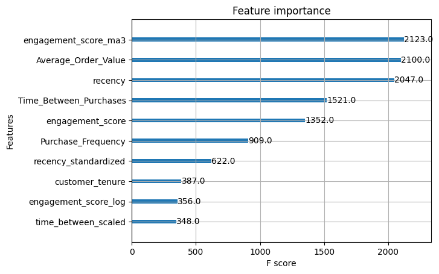
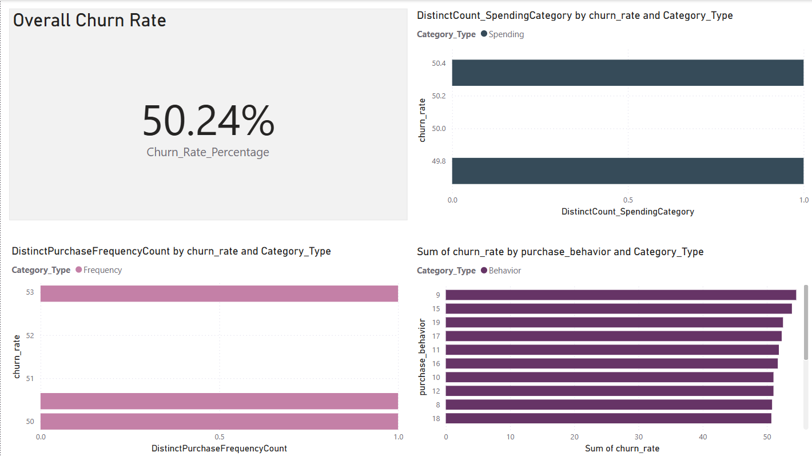
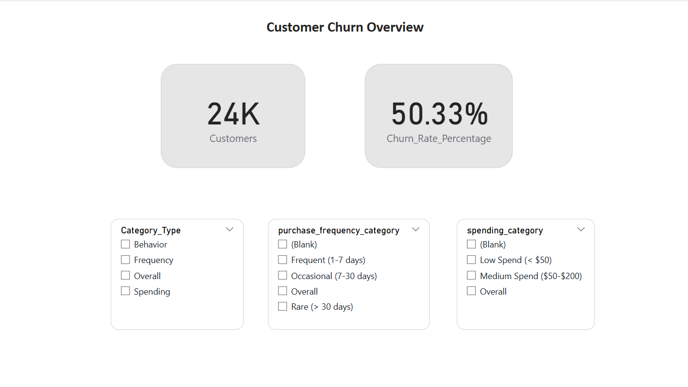

# Overview
This project focuses on analyzing customer churn in an e-commerce business using <b>Python, SQL and Power BI</b>, exploring customer behavior, identifying key factors influencing churn, and presenting insights through an interactive dashboard. The project follows a structured Data Analytics approach, covering <b>data extraction, transformation, analysis, modeling, and visualization</b> to simulate real-world business decision-making.

The dataset includes sales transactions, customer demographics, and engagement details, allowing for a detailed examination of purchase patterns, spending behavior, and retention strategies to drive actionable insights.

## Project Workflow
<b>Step 1:</b> Data Collection & Setup

<b>Step 2:</b> Exploratory Data Analysis (EDA)

<b>Step 3:</b> Feature Engineering & SQL Queries

<b>Step 4:</b> Model Building & Evaluation

<b>Step 5:</b> Interactive Power BI Dashboard

## Tools & Technologies Used
For this Customer Churn Analysis project, I leveraged several key tools and technologies to explore, analyze, and model the data effectively:

- <b>Python</b>: The core programming language used for data analysis, visualization, and machine learning
    - Pandas: Used for data manipulation, handling missing values, and performing exploratory data analysis (EDA)
    - NumPy: Assisted in numerical computations and handling arrays efficiently
    - Matplotlib: Created visual representations of the data to identify patterns and trends
    - Seaborn: Enhanced data visualization with more advanced plots and statistical insights
- <b>SQL (PostgreSQL)</b>: Used for Data storage, querying, and EDA
- <b>Power BI</b>: Dashboard creation with interactive filters and DAX calculations.
- <b>Jupyter Notebook</b>: Served as the interactive environment for coding, visualization, and documentation
- <b>Visual Studio Code (VS Code)</b>: Used for writing, editing, and debugging Python scripts
- <b>Git & GitHub</b>: Essential for version control, tracking changes, and sharing the project publicly

## Step 1: Data Collection & Setup
### Data Analysis
- Imported the raw dataset into PostgreSQL for structured querying
- Verified data integrity, checking for missing values, duplicate entries, and inconsistencies
- Established a connection between PostgreSQL and Power BI for seamless data retrieval

### Data Visualization
Analyzing the Number of Records, Column Names & Data Types
```sql
SELECT COUNT(*) FROM churn_data;

SELECT column_name, data_type
FROM information_schema.columns
WHERE table_name = 'churn_data';
```

### Result
The table contains **1000 rows**, indicating the dataset size.

| Column Name | Data Type |
|------------|----------|
| Churn_Probability | double precision |
| Lifetime_Value | double precision |
| Launch_Date | date |
| Peak_Sales_Date | date |
| Purchase_Frequency | double precision |
| Customer_ID | text |
| Preferred_Purchase_Times | text |
| Transaction_ID | text |
| ... | ... |

### Insights
- Data is structured with key attributes like customer behavior, spending, and churn status
- Requires data cleaning and transformation before analysis

## Step 2: Exploratory Data Analysis (EDA)
### Analysis
Conducted SQL-based EDA using PostgreSQL in pgAdmin 4 to explore the dataset structure, identify key trends, and extract actionable insights.

#### Key Analysis:
1. Dataset Overview

    - Checked the total number of records
    - Verified column names and data types
    - Ensured the dataset contains both numerical and categorical variables

2. Missing Values

    - Verified the presence of <b>NULL values</b> across all columns
    - Found that all columns have <b>0</b> missing values, confirming dataset completeness
    
3. Statistical Summary

    - Computed <b>min, max, and average</b> values for numerical features:
        - Purchase Frequency: <b>Avg ~10</b> (ranges from 1 to 19)
        - Average Order Value: <b>Avg ~$110</b> (ranges from $20 to $200)
        - Time Between Purchases: <b>Avg ~47 days</b> (ranges from 5 to 89 days)
    - Found high variation in purchase behavior, indicating diverse customer engagement

4. Churn Trends by Region

    - Identified the top three regions with the highest churn: <b>Asia, South America, and North America</b>
    - Regional differences suggest a need for targeted retention strategies

5. Most Purchased Product Categories

    - Found that <b>Electronics, Clothing, and Home</b> are the most frequently purchased categories
    - These categories may have the highest impact on <b>customer retention and churn rates</b>

Detailed steps can be found in [`SQL_EDA_Report.md`](Docs/SQL_EDA_Report.md)

### Data Visualization

#### Identifying Top Regions Contributing to Churn
```sql
SELECT "Region", COUNT(*) AS churned_customers
FROM churn_data
WHERE "Churn_Probability" > 0.5
GROUP BY "Region"
ORDER BY churned_customers DESC
LIMIT 5;
```

#### Finding Top 5 Most Purchased Product Categories
```sql
SELECT "Most_Frequent_Category", COUNT(*) AS purchase_count
FROM churn_data
GROUP BY "Most_Frequent_Category"
ORDER BY purchase_count DESC
LIMIT 5;
```

### Result
#### Key Tables & Metrics
| Region | Churned Customers |
|--------|------------------|
| Asia | 1250 |
| South America | 1241 |
| North America | 1231 |
| Europe | 1209 |


| Most Frequent Category | Purchase Count |
|------------------------|---------------|
| Electronics | 2567 |
| Clothing | 2510 |
| Home | 2476 |
| Sports | 2447 |


### Insights
- The dataset is complete, with <b>0 missing values</b>, ensuring reliable analysis
- Churn rates vary by <b>region</b>, suggesting region-specific customer engagement strategies
- Purchase behavior is diverse, with <b>high variance in order value and frequency</b>
- <b>Electronics & Clothing</b> are top categories, potentially impacting customer retention

## Step 3: Feature Engineering & SQL Queries
### Analysis
Performed SQL-based <b>feature engineering</b> using PostgreSQL in pgAdmin 4 to refine raw data into meaningful insights and enhance model performance.

#### Key Analysis:

1. **Customer Segmentation Features**
   - Created **Purchase Frequency Category** (Low, Medium, High) based on transaction frequency.
   - Categorized **Average Order Value (AOV)** into Low, Medium, and High spending groups.

2. **Engagement Metrics**
   - Calculated **Total Orders Per Customer** to track purchasing behavior.
   - Computed **Average Days Between Purchases** to measure engagement levels.

3. **Churn Behavior Indicators**
   - Derived **Last Purchase Recency** to determine how recently a customer made a purchase.
   - Created **Churn Probability Buckets** to classify customers into low, medium, and high-risk churn groups.

Detailed SQL scripts can be found in [`feature_engineering.sql`](sql_queries/feature_engineering.sql)

Details about impact and churn analysis can be found in [`sql_queries_business_insights.ipynb`](notebooks/sql_queries_business_insights.ipynb)

### Data Visualization
#### Calculating Engagement Category distributions
```sql
UPDATE processed_churn_data
SET engagement_category =
    CASE 
        WHEN engagement_score BETWEEN 0 AND 20 THEN 'Low'
        WHEN engagement_score BETWEEN 21 AND 60 THEN 'Medium'
        ELSE 'High'
    END;

SELECT engagement_category,
    COUNT(*) AS total_customers
FROM processed_churn_data
GROUP BY engagement_category;
```

### Result

| Customer_ID | engagement_category | Churn Risk Level |
|------------|-------------------|-----------------|
| 1001       | High             | 1645            |
| 1002       | Medium           | 3359            |
| 1003       | Low              | 4996            |

### Insights
- **Purchase Frequency and AOV Segmentation** help in understanding customer behavior.
- **Average Days Between Purchases** indicates engagement levels.
- **Churn Risk Level** categorization helps in proactive retention strategies.
- These features improve the ability to predict and analyze customer churn effectively.

## Step 4: Model Building & Evaluation
### Analysis
Performed **machine learning model building and evaluation** using Python to predict customer churn effectively. The goal was to apply classification models, evaluate their performance, and optimize them for better accuracy.

#### Key Analysis:

1. **Data Preparation & Splitting**
   - Loaded the processed dataset from PostgreSQL into a Pandas DataFrame.
   - Split data into **training (80%) and testing (20%)** sets using `train_test_split`.
   - Standardized numerical features using **StandardScaler** for better model performance.

2. **Model Selection & Training**
   - Implemented multiple classification models:
     - **Logistic Regression**
     - **Random Forest Classifier**
     - **XGBoost Classifier**
   - Trained models using the training set and stored them for further evaluation.

3. **Model Evaluation Metrics**
   - Used key performance metrics to evaluate model effectiveness:
     - **Accuracy**
     - **Precision, Recall, F1-score**
   - Visualized results using plots.

Detailed model training scripts can be found in [`model_building.ipynb`](notebooks/model_building.ipynb) 

### Data Visualization

#### Splitting the Dataset
```python
from sklearn.model_selection import train_test_split

# Splitting data (80% Train, 20% Test)
X_train, X_test, y_train, y_test = train_test_split(
    X, y, test_size=0.2, random_state=42, stratify=y
)
```

#### Standardizing Features
```python
from sklearn.preprocessing import StandardScaler
scaler = StandardScaler()
X_train_scaled = scaler.fit_transform(X_train)
X_test_scaled = scaler.transform(X_test)
```

#### Training Logistic Regression Model
```python
log_reg = LogisticRegression(random_state=42, max_iter=5000, solver='saga', class_weight='balanced')
log_reg.fit(X_train, y_train)

# Make predictions
y_pred = log_reg.predict(X_test)
```

#### Confusion Matrix Visualization
```python
import matplotlib.pyplot as plt
import xgboost as xgb

xgb.plot_importance(xgb_final, max_num_features=10)
plt.show()
```

### Result
 

### Insights
- **Feature scaling significantly improved Logistic Regression results.**
- **Random Forest performed well** but had slightly lower recall than XGBoost.

These results help in selecting the most effective model for predicting customer churn and improving retention strategies.

## Step 5: Interactive Power BI Dashboard
### Objective
Designed an **interactive Power BI dashboard** to visualize customer churn insights effectively, helping stakeholders make data-driven decisions. The dashboard includes key churn metrics, customer segmentation insights, and interactive slicers for better analysis.

### Dashboard Structure

#### **Page 1: Churn Overview**
This page provides a high-level summary of churn-related metrics and visualizations.

- **Churn Rate Analysis**: Displays overall churn percentage.
- **Churn by Purchase Behavior**: Identifies spending patterns of churned vs. retained customers.
- **Churn by Purchase Frequency**: Categorizes customers based on their purchase frequency and churn behavior.
- **Churn by Spending**: Analyzes customer spending patterns and their impact on churn.

#### **Page 2: Customer Segmentation & Filtering**
A more interactive analysis with filters and dynamic insights.

- **Churn Rate & Total Customers**: Displays key KPIs at a glance.
- **Interactive Slicers**:
  - Purchase Behavior
  - Purchase Frequency Category (Low, Medium, High)
  - Spending Category (Low, Medium, High)
- Users can apply filters dynamically to explore different customer segments and their churn likelihood.

### Data Processing for Power BI

1. **Data Preparation in Excel**
   - Merged tables manually in **Excel** instead of using Power Query to gain Excel proficiency.
   - Created a final dataset ready for Power BI visualization.

2. **Power BI Data Import**
   - Loaded cleaned and structured data into Power BI.

3. **Dashboard Development**
   - Created **DAX Measures** for key insights (e.g., Churn Rate, Total Customers, Segmentation Metrics).
   - Used **Bar Charts, Line Graphs, and KPI Cards** for intuitive representation.
   - Implemented **interactive slicers** for dynamic filtering.

### Key DAX Calculations

#### **Churn Rate Calculation**
```DAX
Churn Rate =
DIVIDE(
    COUNTROWS(FILTER(CustomerData, CustomerData[Churn_Status] = "Churned")),
    COUNTROWS(CustomerData)
)
```

#### **Total Customers**
```DAX
Total Customers = COUNTROWS(CustomerData)
```

### Results
 

*churn-related metrics and visualizations*

 

*Interactive Dashboard*

### Insights & Impact

- **Customer Segmentation Analysis** provides deeper insights into purchasing patterns and their correlation with churn.
- **Interactive Filtering** allows business users to dynamically analyze churn trends.
- **Powerful Data Visualization** makes insights easily understandable for stakeholders.
- The dashboard enhances decision-making by identifying key churn drivers and customer retention strategies.

### Next Steps
- Enhance dashboard interactivity further with advanced **DAX calculations**.
- Consider integrating **real-time data updates** from PostgreSQL.
- Explore **Power BI Service** for publishing and sharing the dashboard with stakeholders.

The final **Power BI Dashboard ([`dashboard.pbix`](power_bi/dashboard.pbix))** is saved in the main project folder.

## Future Improvements
This project provides a solid foundation for customer churn analysis, with potential enhancements:

- **Better Feature Engineering**: Incorporate **customer sentiment analysis** and **RFM segmentation**
- **Advanced Machine Learning**: Tune models with **GridSearchCV**, explore **deep learning (LSTM)** for sequential data
- **Real-Time Monitoring**: Deploy a **Flask/FastAPI** system for real-time churn predictions
- **Dashboard Enhancements**: Add **advanced DAX calculations** and **predictive analytics** in Power BI

## Conclusion
This project successfully analyzes customer churn using **SQL, Python, and Power BI,** providing:

- **Data-driven insights** into customer churn patterns through SQL analysis
- **Predictive insights** using statistical modeling to identify key churn factors
- **Interactive dashboards** in Power BI for actionable business decisions